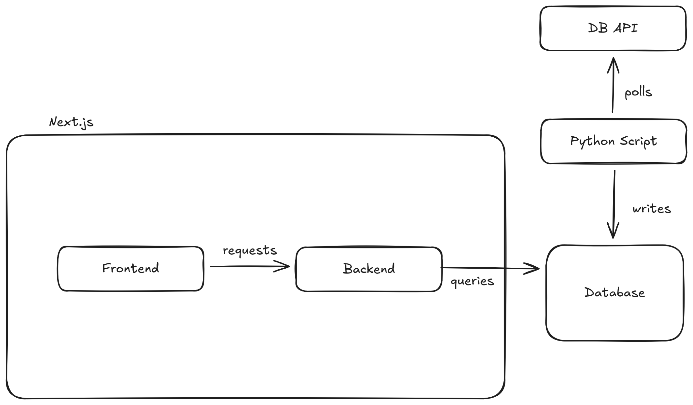

# Laborbericht

## 1. Einleitung

### Motivation
In Zeiten, in denen bewusstes Konsumieren und nachhaltiges Reisen aufgrund des Klimawandels immer relevanter werden, steigt auch die Popularität von „Slow Travel” und grünem Reisen gegenüber kurzen und CO2-intensiven Verkehrsmitteln. Nachhaltiges Reisen kann durch Zug-, Busfahren oder Carpooling gewährleistet werden.
In diesem Projekt befassen wir uns mit der Deutschen Bahn. Die Deutsche Bahn ist leider nicht für ihre Pünktlichkeit und Zuverlässigkeit bekannt, doch es gibt wenige Alternativen, wenn man eine Zugreise planen möchte.
Vor diesem Hintergrund soll das folgende Projekt bei der Planung von Zugreisen innerhalb Deutschlands helfen. In einer Webanwendung sollen statistische Informationen über die Pünktlichkeit von Zügen an verschiedenen Stationen der Deutschen Bahn dargestellt werden. Diese Informationen sollen Reisenden dabei helfen, datengetriebene Entscheidungen für ihre nächste Zugreise zu treffen.
Zur Vertiefung: Dieses Projekt zielt darauf ab, Nutzerinnen und Nutzern fundierte Entscheidungsgrundlagen zu liefern, indem es historische Pünktlichkeitsdaten der Deutschen Bahn systematisch sammelt, aufbereitet und visualisiert. Neben der praktischen Reiseplanung soll die Anwendung Trends und Schwachstellen im Netz sichtbar machen, um sowohl Pendlern als auch Forschenden und Verkehrsplaner:innen Erkenntnisse über wiederkehrende Verzögerungsmuster zu bieten. Ein weiterer Motivationsaspekt ist die Förderung nachhaltiger Mobilitätsentscheidungen: verlässliche Informationen über Zugqualität stärken das Vertrauen in den öffentlichen Verkehr.

### Zielsetzung
Das Web-Projekt soll aus zwei Seiten bestehen. Eine Seite zeigt eine Übersicht der Deutschlandkarte mit ausgewählten Stationen der Deutschen Bahn. Je nach relativer Anzahl verspäteter Züge wird die Station entsprechend rot eingefärbt. 
Auf der zweiten Seite kann der Nutzer eine konkrete Zug-Verbindung abonnieren. Sobald diese Verbindung festgelegt wird werden alle möglichen Verbindungen zwischen diesen beiden Stationen angezeigt und Statisken zu dieser Verbindung ausgewertet.

**Konkrete Zielsetzungen**
- Bereitstellung einer interaktiven Netzwerk-Übersicht, die Bahnhöfe nach Verspätungsquote visualisiert und dynamisch filterbar ist (Verkehrstyp, Ankunft/Abfahrt, Zeitraum).
- Implementierung eines Abonnementsystems für Verbindungen mit Detailauswertungen (Umstiege, Alternativrouten, historische Pünktlichkeitsstatistiken).
- Aufbau einer zuverlässigen Daten-Pipeline (API-Abfrage, Persistenz in PostgreSQL, Aggregation, Caching) für reproduzierbare Analysen.
- Export- und Benachrichtigungsfunktionen (CSV/JSON-Export, Alerts bei signifikanten Änderungen oder langen Verspätungen).
- Nicht-funktionale Ziele: skalierbare Architektur, akzeptable Antwortzeiten für Visualisierungen und Einhaltung datenschutzrechtlicher Vorgaben.

## 2. Grundlagen
### Detaillierte Problemstellung

#### **Technologieauswahl**
Dieses Web-Projekt verwendet Next.js als Framework für sowohl das Frontend als auch das Backend. Da Next.js eine Fullstack Anwendung vereinfacht dies die Notwendigkeit sowohl ein Frontend- als auch ein Backend-Repository aufzusetzen. Zusätzlich ist Next.js ein React Framework. Da React eine aktuell sehr beliebt im Kontext des Webdevelompent ist, erachten wir es als sinnvoll Erfahrungen mit diesem Framework zu sammeln.

Für die Umsetzung des Frontends wurden die Frontend Bibliotheken [HeroUI](https://www.heroui.com/) und [d3.js](https://d3js.org/) genutzt. HeroUI bietet eine große Auswahl an Frontend Komponenten an und verschnellert so die Entwicklung im Frontend ohne zusätzliche Koten, da es eine Open-Source Bibliothek ist. D3.js ist mit 112 Tausend Sternen auf Github einer der größten und beliebtesten Open-Source Bibliotheken für die Daten-Visualisierung im Web.

Die Daten, die für das Projekt werden von der [Deutschen Bahn API](https://developers.deutschebahn.com/db-api-marketplace/apis/frontpage) zugestellt. Das Speichern der Daten erfolgt über Postgresql. Wir haben eine relationale Datenbank gewählt, da

Da Verspätungen von Bahnen gelöscht werden, sobald Sie von der jeweiligen Station abgefahren sind, war es hier notwendig, dass wir die abgefragten Daten der API in eine eigene Datenbank speichern. So gewährleisten wir, dass auch Verspätungen aus den vorherigen Tagen für den Nutzer verfügbar sind.

Das Abfragen und Speichern von Daten der Deutschen Bahn API erfolgt seperat über Python. Python bietet, als eine Programmiersprache die oft im Kontext von Datenverarbeitung genutzt wird, eine breites Angebot für die Daten-Verarbeitung und -Aggregation.

#### **Use Cases**
Das System verfolgt zwei zentrale Use Cases: Zum einen eine interaktive Heatmap, die Bahnhöfe nach ihrer relativen Verspätungsquote farblich darstellt und sich dynamisch nach Verkehrstyp (Nah-/Fernverkehr/alle), Ankunft/Abfahrt und Datum filtern lässt, um schnell problematische Abschnitte im Netz zu identifizieren.
Zum anderen eine Verbindungsauswertung, die es Nutzern ermöglicht, konkrete Reisen (inkl. Umstiegen) zu abonnieren und für diese historische Pünktlichkeitsstatistiken, zeitliche Muster sowie alternative Routen bereitzustellen – nützlich zur Reiseplanung, Abschätzung von Ausfallrisiken und zur Vorbereitung von Entschädigungsanträgen. Beide Funktionen bieten aggregierte Kennzahlen, Visualisierungen und Exportmöglichkeiten sowie die Option, Benachrichtigungen bei relevanten Änderungen zu erhalten, sodass Pendler, Gelegenheitsreisende und Forschende datenbasierte Entscheidungen treffen können.

#### **Muss-/Kann-Kriterien**

#### Muss

- Daten Aggregation, Caching
- Bedienung durch Frontend
- Interaktive Karte
    - Heatmap mit verspäteten Ankünften, Abfahrten an Stationen
- Visualisierung von Verspätungen im Netz der Deutschen Bahn
    - Timeline über die letzten X Tage
- Informationen über Züge mit Verspätung > 60 Min

#### Kann
- Erweiterung auf europäisches Bahnnetz
- Prognose für verspätete Züge
- Merken von mehreren Reisen
    - Festes Start und Endziel
- Formular für Einreichen von Verspätungen direkt an DB weitergeleitet

## 3. Umsetzung / Implementierung

## 4. Fazit

